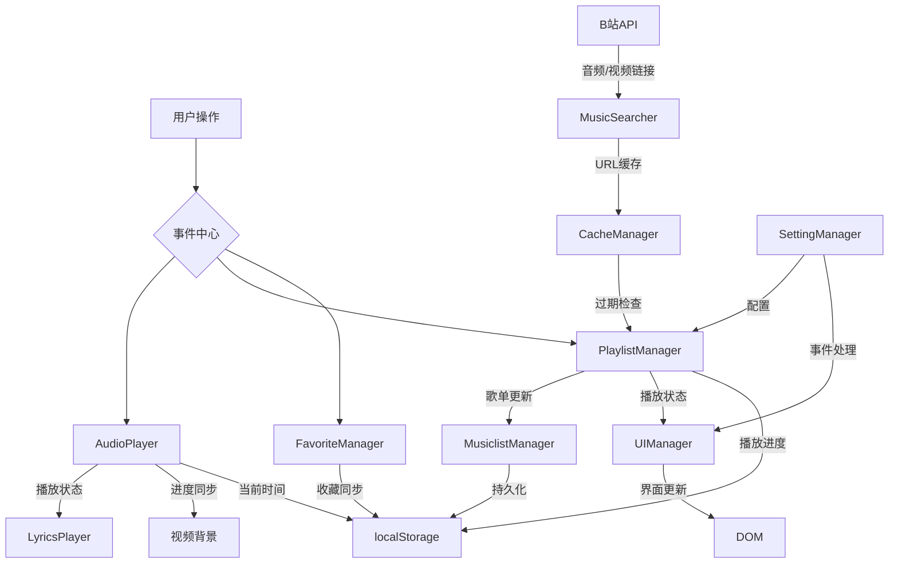

# NB Music


## 简介
由NB-Group和User782Tec两名初中生开发的跨平台音乐播放器！无需VIP就能畅听全网音乐，因为我们直接从哔哩哔哩获取音频资源~ 
这里有：
- 全网音乐自由播放（包括其他平台要VIP的歌曲！）
- 一键导入B站收藏夹当歌单
- 智能歌词捕捉系统（自动匹配+手动补全双保险）

**初中生の黑科技宣言**：我们才不是只会做题的小可爱！用Electron+各大API，带你体验真正的白嫖听歌自由ψ(｀∇´)ψ

哦，对了！我们基于以下开源项目，感谢他们！
- [neteasecloudmusicapi](https://gitlab.com/Binaryify/neteasecloudmusicapi) 网易云API(Github仓库已经寄了)
- [BillBill Api Collect](https://github.com/SocialSisterYi/bilibili-API-collect) B站API
---

## 用户指南

### 下载
[Releases](https://github.com/NB-Group/NB_Music/releases)查看最新版本喵！
话说应该会有自动更新的，代码里写了的（）
### 特色功能说明书
**B站相关**  
- 我们从B站自动抓取最高音质版本（悄悄说：登录带大会员的账号才能听Hi-Res的QwQ）
- 收藏夹一键导入歌单（一点迁移成本都没有哦）

**歌词相关**
- 从网易云自动抓取歌词捏。  
- 自动匹配歌词的不对？你可以手动歌名（然后我们再去全网搜刮~记得在设置里打开哦）

**🛠️ 遇到问题怎么办？**  
- 歌曲加载失败→多点几次播放键（我们的重试机制超顽强！）
- 其他bug→对着屏幕说"修好它！"（然后重启应用就OK啦~才怪！要记得反馈给我们哦）
- 当然，修bug最重要的还是重启应用啦！

---

## 开发者文档

### 架构设计


#### 技术栈

- 🚀 Electron - 跨平台桌面应用开发框架
- 🎵 Html Dom API - 音频处理
- 🎨 原生 CSS - 界面样式
- 📦 Yarn - 包管理器
- 🔄 GitHub Actions - CI/CD
#### 核心模块
```bash
├──  .git/                       # Git版本控制文件夹
├──  .gitattributes               # Git属性配置
├──  .github/                     # GitHub工作流配置
│   ├──  workflows/               # CI/CD工作流配置
│   │   ├──  release.yml          # 发布工作流
├──  .gitignore                   # Git忽略文件配置
├──  .gitmodules                  # Git子模块配置
├──  .prettierrc                  # Prettier配置
├──  .vscode/                     # VSCode配置文件夹
│   ├──  launch.json              # 调试配置文件
├──  LICENSE                      # 项目许可证
├──  README.md                    # 项目说明文档
├──  dist/                        # 构建输出文件夹
├──  eslint.config.mjs            # ESLint配置
├──  icons/                       # 项目图标资源
│   ├──  NB Music.png             # 应用图标
│   ├──  icon.icns                # macOS图标
│   ├──  icon.ico                 # Windows图标
│   ├──  icon.png                 # PNG格式图标
├──  image.png                    # 用于展示的图片
├──  img/                         # 项目图像资源
│   ├──  NB_Music.png             # 封面图像
│   ├──  poster.jpeg              # 海报图像
├──  package.json                 # 项目依赖管理
├──  public/                      # 公共资源文件夹
├──  src/                         # 源代码文件夹
│   ├──  javascript/              # JavaScript文件
│   │   ├──  AudioPlayer.js       # 音频播放器功能
│   │   ├──  CacheManager.js      # 缓存管理器
│   │   ├──  FavoriteManager.js   # 收藏管理器
│   │   ├──  LoginManager.js      # 登录管理器
│   │   ├──  LyricsPlayer.js      # 歌词播放器
│   │   ├──  MusicSearcher.js     # 音乐搜索器
│   │   ├──  MusiclistManager.js  # 歌单管理器
│   │   ├──  PlaylistManager.js   # 播放列表管理器
│   │   ├──  SettingManager.js    # 设置管理器
│   │   ├──  UIManager.js         # UI管理器
│   │   ├──  UpdateManager.js     # 更新管理器
│   ├──  main.html                # 主要HTML文件
│   ├──  main.js                  # 主要JavaScript文件
│   ├──  script.js                # 辅助脚本
│   ├──  splash.html              # 启动画面HTML
│   ├──  styles/                  # 样式文件夹
│   │   ├──  base.css             # 基础样式
│   │   ├──  components/          # 组件样式
│   │   │   ├──  animations.css   # 动画样式
│   │   │   ├──  controls.css     # 控件样式
│   │   │   ├──  dialogs.css      # 对话框样式
│   │   │   ├──  lyrics.css       # 歌词样式
│   │   │   ├──  musiclist.css    # 歌单样式
│   │   │   ├──  notifications.css # 通知样式
│   │   │   ├──  player.css       # 播放器样式
│   │   │   ├──  settings.css     # 设置样式
│   │   │   ├──  sidebar.css      # 侧边栏样式
│   │   │   ├──  song.css         # 歌曲样式
│   │   │   ├──  titlebar.css     # 标题栏样式
│   │   ├──  index.css            # 首页样式
│   │   ├──  utilities.css        # 辅助样式
│   │   ├──  variables.css        # 变量样式
│   ├──  utils.js                 # 工具函数
├──  yarn.lock                    # Yarn锁文件

```

#### 数据流向


### 贡献指南
1. 克隆仓库后执行 `yarn add --magic`（开玩笑的，正常add就好）
2. 调试主进程：`yarn run electron:debug`
3. 直接运行: `yarn run run`
4. 打包: `yarn run build`
5. 代码规范：
   - 一定要组件化哦！面向对象启动！
   - 用yarn！
   - 其它没啥，代码合理即可。
   - 求大佬PR（雾）
6. 提PR时请附上猫耳表情包以通过审核（大雾）

---

# NB Music 官方网站

这是 NB Music 音乐播放器的官方宣传网站，采用苹果风格设计，支持深色模式，具有流畅的动画和响应式布局。

## 功能特点

- 🌓 自动和手动深色模式切换
- 🖼️ 苹果风格的视觉效果和排版
- 📱 全响应式设计，适配各种设备
- ✨ 丰富的动画和交互效果
- 🚀 高性能，无依赖

## 快速开始

### 本地运行

1. 克隆此仓库
```bash
git clone https://github.com/NB-Group/NB-Group.github.io.git
```

2. 进入项目目录
```bash
cd NB-Group.github.io/nb-music
```

3. 使用任意 HTTP 服务器运行网站，例如：
```bash
# 如果安装了 Python 3
python -m http.server

# 如果安装了 Node.js
npx serve
```

4. 打开浏览器访问 `http://localhost:8000` 或服务器显示的地址

### 部署到 GitHub Pages

此网站已配置为使用 GitHub Pages 自动部署。只需将更改推送到主分支即可。

## 文件结构

```
nb-music/
├── index.html          # 主 HTML 文件
├── README.md           # 项目说明文件
├── img/                # 图片资源
│   ├── favicon.ico     # 网站图标
│   ├── screenshot-main.png # 主屏幕截图
│   ├── parallax-bg.jpg # 视差背景图片
│   ├── bilibili-feature.png # B站功能截图
│   └── lyrics-feature.png # 歌词功能截图
├── scripts/            # JavaScript 文件
│   └── main.js         # 主 JS 文件
└── styles/             # CSS 样式文件
    └── main.css        # 主 CSS 文件
```

## 自定义指南

### 更换图片

1. 将您的图片放在 `img/` 文件夹中
2. 在 `index.html` 中更新相应的图片路径

### 修改颜色主题

编辑 `styles/main.css` 中的 `:root` 和 `[data-theme="dark"]` 变量以更改亮色和深色模式的颜色。

### 添加新内容

在 `index.html` 中添加新的部分，并在 `styles/main.css` 中为其添加样式。

## 贡献

如果您想为此项目贡献代码，请：

1. Fork 此仓库
2. 创建一个新分支 (`git checkout -b feature/your-feature`)
3. 提交您的更改 (`git commit -am 'Add some feature'`)
4. 推送到分支 (`git push origin feature/your-feature`)
5. 创建一个新的 Pull Request

## 许可

此项目基于 [GPL-3.0 许可证](https://github.com/NB-Group/NB_Music/blob/main/LICENSE) 开源。

## 鸣谢

- 感谢 NB-Group 和 User782Tec 开发出色的 NB Music 应用
- [neteasecloudmusicapi](https://gitlab.com/Binaryify/neteasecloudmusicapi) - 网易云 API
- [BillBill Api Collect](https://github.com/SocialSisterYi/bilibili-API-collect) - B站 API

**版权说明**  
开源协议：[GPL-3.0](LICENSE) 
开发团队：NB-Group和User782Tec这两名初中生（作业没写完也要写代码的传说！）（其实我们成绩都很好的啦）

尽管我们代码开源，但我们仍受《中华人民共和国著作权法》的保护。
禁止一切使用我们源代码的商业行为，包括但不限于，打包售卖、未经允许的搬运等。
（上次我们的Win12就被倒卖源码了QwQ）
如果用于学习交流，那么请便，但是务必标注作者和项目链接哦。

其它条款请见 [GPL-3.0](LICENSE) 协议文本。